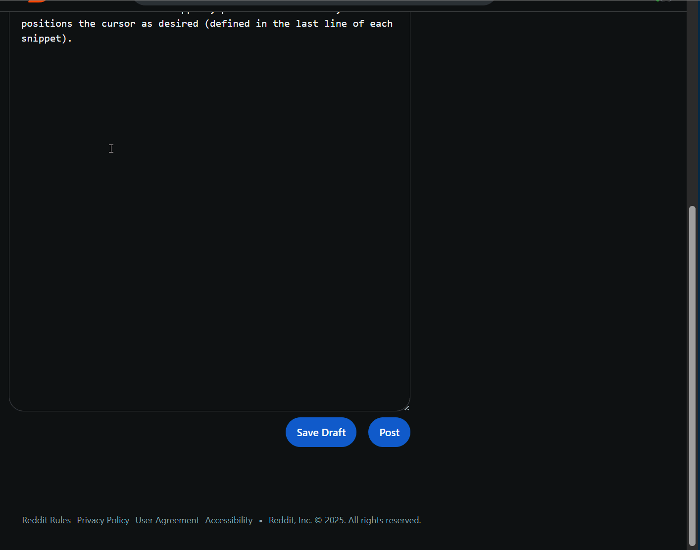
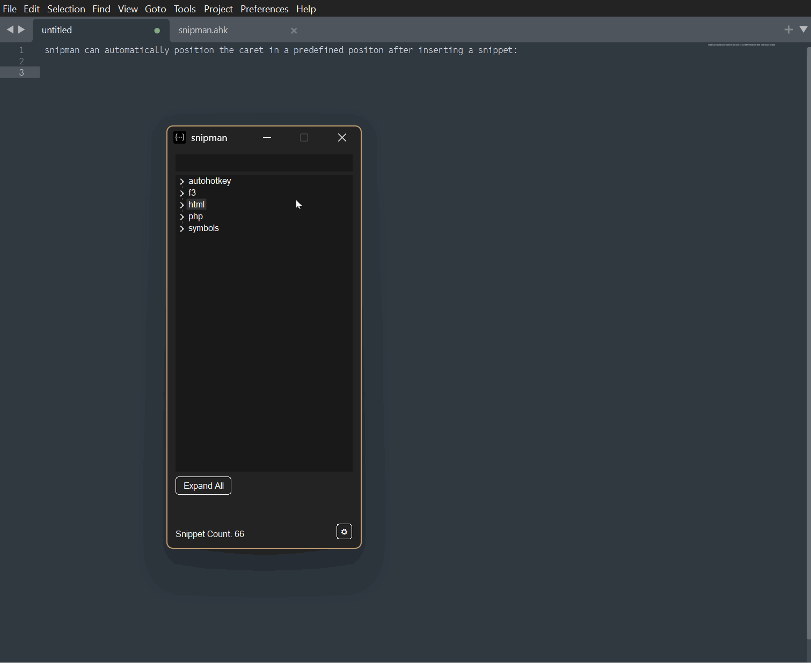

```c
*                                                                     *
*      ███████ ███    ██ ██ ██████  ███    ███  █████  ███    ██      *
*      ██      ████   ██ ██ ██   ██ ████  ████ ██   ██ ████   ██      *
*      ███████ ██ ██  ██ ██ ██████  ██ ████ ██ ███████ ██ ██  ██      *
*           ██ ██  ██ ██ ██ ██      ██  ██  ██ ██   ██ ██  ██ ██      *
*      ███████ ██   ████ ██ ██      ██      ██ ██   ██ ██   ████      *
*                                                                     *
*      |___________________ SNIPPET MANAGER ___________________|      *
*                                                                     *
```

# [snipman](https://github.com/pa-0/snipman)

snipman is a snippet manager written in AutoHotkey v2

## Features

- massCode integration (loads snippets directly from your massCode database)
- Alternatively, load snippets directly from plain text files or scripts
- Full text preview on snippet hover
- Automatic dark / light mode theme based on system settings
- Option to run automatically with Windows
- Position the caret inside the snippet after inserting it into a document (see demo)

  

- Incremental Search
  
  

## Special Thanks and Credits to:

- @ethanpil for [snips]( https://github.com/ethanpil/snips), the inspiration for snipman as well as the snippet examples ('snips' folder)
- @just me (on AutoHotkey Forum) for Class ToolTipOptions, and the Example Settings GUI,
- @nperovic for all of their work on Dark mode GUIs, including DarkListView.ahk and SetWindowColor.ahk,
- @geek (on AutoHotkey Forum) for cJSON.ahk,
- @The-CoDingman on GitHub for OD_Colors,
- @MrDoge (on AutoHotkey Forum) for svgtoHBITMAP.ahk, and
- [AutoHotKey](https://autohotkey.com/) developers and forums.

## License and Copyright

Copyright (C) Peter Abbasi 2025
Released under the [GPLv3 license](https://www.gnu.org/licenses/gpl-3.0.en.html), included as LICENSE
